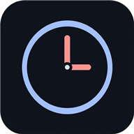

<div align="center">
  
  <h1>Chronos</h1>
  <p><strong>A beautiful 24-hour circular schedule planner — built with Material Design 3</strong></p>
  <p>
    <a href="https://hvbansode.github.io/Chronos/">🌐 Live Demo</a> &nbsp;·&nbsp;
    <a href="#features">Features</a> &nbsp;·&nbsp;
    <a href="#getting-started">Getting Started</a>
  </p>
</div>

---

## Overview

Chronos lets you plan your entire day on a 24-hour clock ring. Instead of a flat list, you interact with a living, circular timeline — drag task edges to resize, move tasks by dragging their slice, and watch the current time marker sweep in real time.

Built entirely with **vanilla JS + CSS**, no UI frameworks. Material Design 3 design system throughout.

## Features

- 🕐 **24-hour circular clock ring** — see your whole day at a glance
- ✋ **Drag & drop** — move and resize tasks directly on the clock
- 💬 **Smart Add** — type `"Meeting at 10am for 1h"` and it parses automatically
- 📋 **Routines** — save and load full day schedules as named routines
- ⏱️ **Live countdowns** — hub clock shows time remaining in current task
- 🔔 **Desktop notifications** — get notified when tasks start and end
- 🌓 **Dark / Light theme** — toggle with full M3 color token support
- 📱 **PWA** — install it on mobile or desktop, works fully offline
- ⌨️ **Keyboard shortcuts** — `N` to add task, `Esc` to dismiss/deselect

## Tech Stack

| Layer      | Choice                            |
| ---------- | --------------------------------- |
| Framework  | Vanilla JS (ES Modules)           |
| Build tool | Vite 5                            |
| Styling    | Vanilla CSS with M3 Design Tokens |
| Storage    | IndexedDB via `idb-keyval`        |
| PWA        | `vite-plugin-pwa` + Workbox       |
| Tests      | Vitest                            |
| Icons      | Material Symbols Rounded          |
| Fonts      | Roboto, JetBrains Mono            |

## Getting Started

### Prerequisites

- Node.js 18+ and npm

### Installation

```bash
git clone https://github.com/hvbansode/Chronos.git
cd Chronos
npm install
```

### Development

```bash
npm run dev
```

Opens at `http://localhost:3000`

### Build for Production

```bash
npm run build
```

Output goes to `dist/`. Ready for GitHub Pages or any static host.

### Run Tests

```bash
npm run test
```

## Keyboard Shortcuts

| Key                 | Action                       |
| ------------------- | ---------------------------- |
| `N`                 | Open Smart Add dialog        |
| `Esc`               | Close dialog / deselect task |
| `Enter` / `Space`   | Activate focused element     |
| Double-tap on slice | Open task editor             |

## Project Structure

```
Chronos/
├── public/           # Static assets (icons, favicon)
├── src/
│   ├── components/   # UI components (Clock, TaskList, SmartAdd, …)
│   ├── core/         # Store (state management) & Events
│   ├── styles/       # Modular CSS (variables, base, layout, components)
│   └── utils/        # TimeUtils, MathUtils, SmartParser
├── tests/            # Vitest unit tests
├── index.html        # App shell
└── vite.config.js    # Vite + PWA configuration
```

## License

MIT © 2025 Chronos
